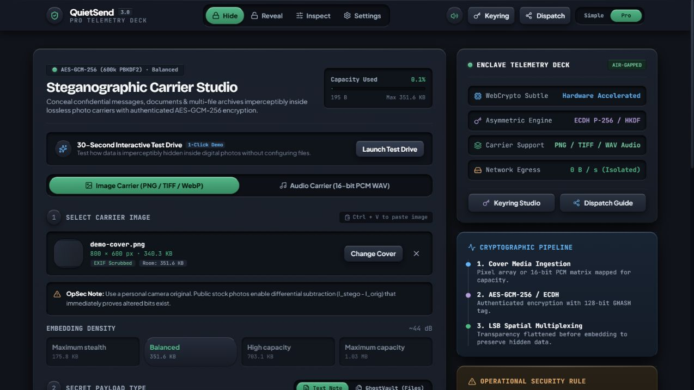
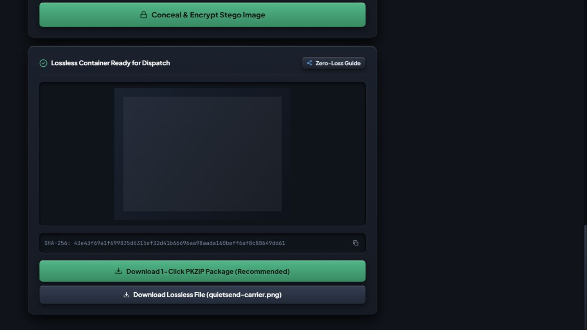
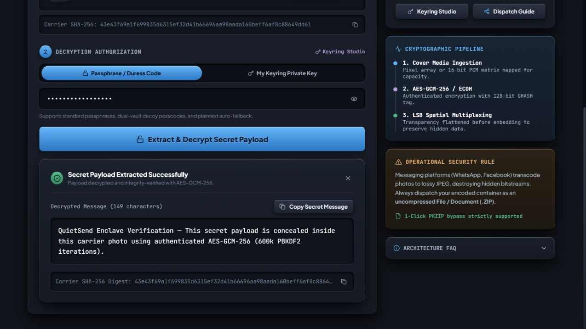

# QuietSend by GhostByte

**Hide encrypted messages and files inside images or WAV audio — directly in your browser.**

[Open QuietSend](https://ghostbyte-seven.vercel.app/) · [Source code](https://github.com/tejas-ai/ghostbyte) · [Meet the developer](https://www.linkedin.com/in/tejashandigol/)

QuietSend is an open-source steganography application built by **Tejas Handigol**. GhostByte is the project brand and repository name; QuietSend is the application. It combines local file processing, authenticated encryption, and tools that show how embedding changes a carrier.

No account or API key is required. Payloads, passphrases, and carrier files are processed locally by the application. The website host still serves the app's code and static assets.

## Try it

1. Open **[ghostbyte-seven.vercel.app](https://ghostbyte-seven.vercel.app/)**.
2. Choose a cover photo and enter a message or select files.
3. Set a passphrase, conceal the payload, and download the lossless carrier.
4. Open **Reveal**, select the saved carrier, and enter the same passphrase.

Share the output as a **file/document or ZIP**, not a compressed chat photo. Image recompression destroys hidden data. Transparent areas are flattened onto white before embedding to keep the saved payload recoverable.

The app supports offline use after its first successful online load and cache installation. Browser storage clearing or eviction requires another online visit.

Carrier images have **no app-defined upload size or resolution limit** in Hide, Reveal, or Inspect. Images stay at their original resolution. The practical maximum depends on your browser's decoder, canvas support, and available device memory; very large images may require a more capable device. Limits on embedded secret-file archives and WAV audio are separate.

## Working screenshots

Captured from the public HTTPS app using the built-in demo. The same exported PNG was reloaded and its message successfully decrypted and integrity-verified.

| Prepare a carrier | Export the encrypted result | Recover the message |
| --- | --- | --- |
|  |  |  |

## Features

| Workflow | What it provides |
| --- | --- |
| Simple Hide & Reveal | A guided workflow for messages and file archives |
| Pro Workbench | Image density controls, recipient public keys, WAV carriers, and dual vaults |
| Encryption | AES-GCM-256 with PBKDF2-HMAC-SHA-256 at 600,000 iterations |
| Recipient keys | ECDH P-256 with HKDF-SHA-256 and a local keyring |
| File archives | Multiple embedded files and working ZIP export |
| Visual inspection | Before/after comparison, MSE, PSNR, difference heatmaps, and bit planes |
| Browser experience | Responsive layouts, five interface languages, background workers, and offline caching |

Image imports include PNG, JPG, WebP, BMP, and TIFF; encoded image output is PNG. Audio encoding uses uncompressed 16-bit PCM WAV.

## Security boundaries

- **Encryption and hiding are different.** Without a passphrase, extracted content is readable. A strong passphrase is required for the symmetric encryption workflow.
- **LSB steganography is detectable.** It can hide content from casual viewing, but statistical analysis and comparison with an original can reveal changes.
- **You must trust the delivered code.** A compromised host, browser, extension, or device can undermine browser cryptography. Running reviewed source locally reduces reliance on a live website.
- **Recipient encryption does not authenticate the sender.** ECDH envelopes do not include digital signatures.
- **Dual vaults have limits.** A decoy password opens separate content; this does not guarantee deniability against forensic analysis or coercion.
- **Lossy transformations destroy payloads.** Keep the original lossless output and share it without recompression.

Read **Settings → Threat Model & Cryptographic Boundaries** before using the app for sensitive information. This is an independently developed project, not a certified or independently audited security product.

## Stack

React 19 · TypeScript · Vite · Tailwind CSS · Web Crypto API · Web Workers · Service Worker · UTIF

## Run locally

Use Node.js **22.12 or newer** and npm.

```bash
git clone https://github.com/tejas-ai/ghostbyte.git
cd ghostbyte
npm ci
npm run dev
```

No Gemini key, backend service, or database is needed. Encryption requires HTTPS or localhost.

## Validate and build

```bash
npm test
npm run typecheck
npm run build:verify
npm run preview
```

The September 2026 functional review passed **26 automated tests** and **14 browser service regression cases**. It also verified a production draft-transfer workflow, mobile layout, and a first offline reload with the preview server stopped.

See the [fixes and validation report](review-reports/2026-09-27/FIXES_AND_VALIDATION.md) for scope and limitations. Test success is evidence for those cases, not a guarantee that every browser or input is covered.

`build:verify` builds `dist/` and writes per-file SHA-256 hashes to `dist/SHA256SUMS`. It calculates a manifest; independent verification requires comparison with a trusted release manifest. Use a fixed `VITE_BUILD_ID` when comparing builds because the service-worker cache identifier otherwise changes each build.

## Deployment

The public app is hosted at **https://ghostbyte-seven.vercel.app/**. The repository includes Vercel and Netlify configuration with security and cache headers. See [DEPLOYMENT.md](DEPLOYMENT.md).

Tutorial video files are excluded from Git. Deployments without them show the written walkthrough fallback. Core Hide, Reveal, and Inspect workflows do not depend on those videos.

## Author and license

Built by [Tejas Handigol](https://www.linkedin.com/in/tejashandigol/) · [GitHub](https://github.com/tejas-ai)

[MIT License](LICENSE). Feedback and reproducible bug reports are welcome through [GitHub Issues](https://github.com/tejas-ai/ghostbyte/issues).
